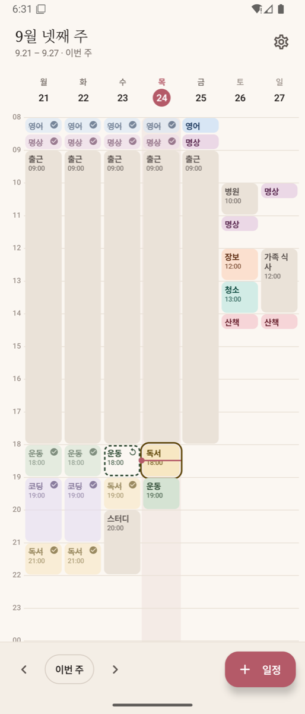
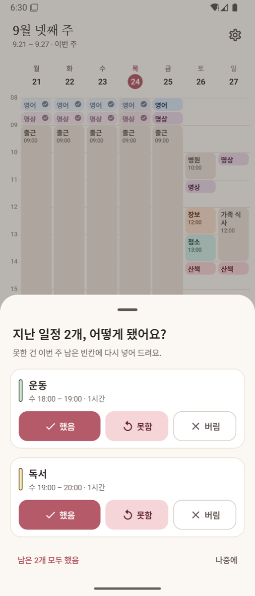
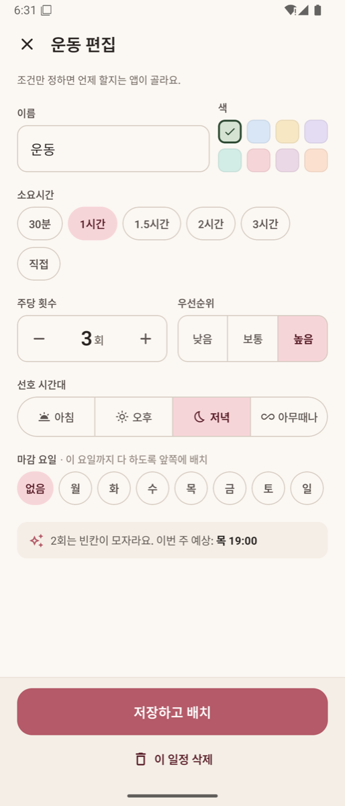
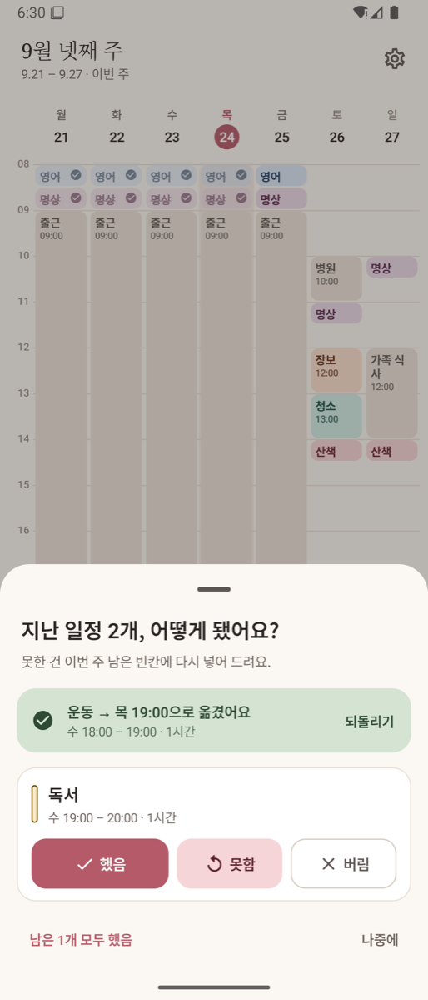
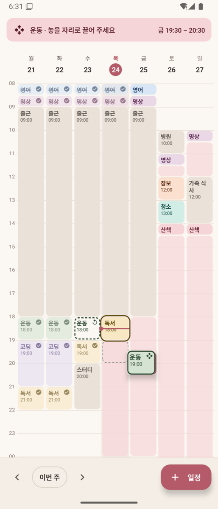
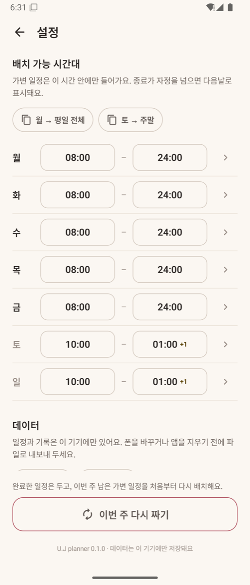
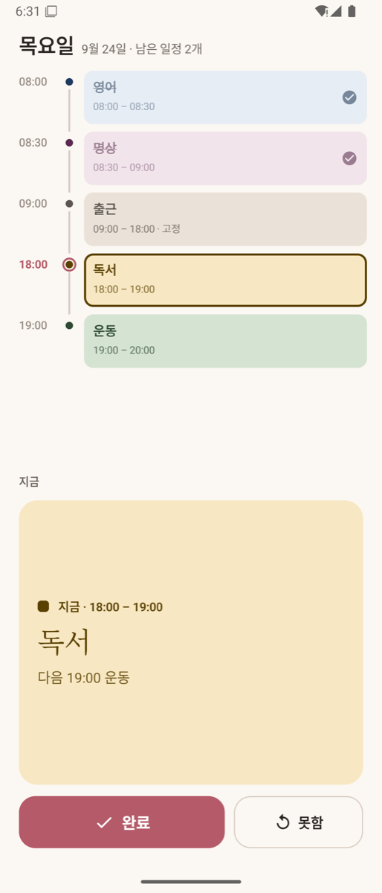
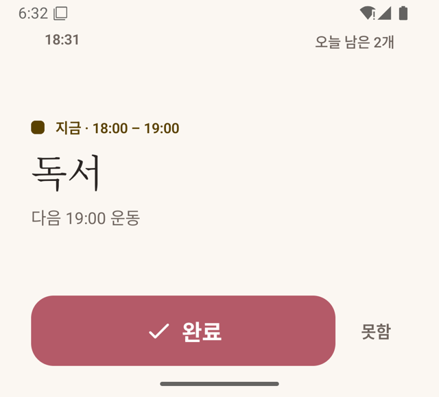

# U.J planner

**주간 자동 배치 플래너**. 안드로이드와 iOS 에서 같은 앱이 돈다.
움직이지 않는 일정(출근, 수업)만 직접 넣으면, 나머지 할 일은 앱이 이번 주 남는 시간에 알아서 넣는다.
못 했으면 물어보고 다른 빈칸에 다시 넣는다. 서버 없이 폰 안에서만 돈다.

<p>
  
  
  
</p>

> 설치는 [`GUIDE.md`](GUIDE.md), 코드 구조와 작업 규칙은 [`CLAUDE.md`](CLAUDE.md).

## 어떻게 쓰나

일정은 두 가지다.

| | 넣는 것 | 누가 자리를 정하나 |
|---|---|---|
| **고정 일정** | 이름 · 요일(여러 개) · 시작 시각 · 소요시간 | 사람. 매주 같은 자리에 회색 블록으로 깔린다 |
| **가변 일정** | 이름 · 색 · 소요시간 · 주당 횟수 · 우선순위 · 선호 시간대 · 마감 요일 | 앱. 조건만 주면 빈칸을 찾아 넣는다 |

한 주가 단위다. 새 주가 되면 가변 일정은 주당 횟수를 새로 받아 다시 배치된다.

### 자동 배치 규칙

1. 요일별 **배치 가능 시간대**(설정)에서 고정 일정과 이미 지난 시간을 뺀 것이 빈칸이다
2. **마감 빠른 순 → 우선순위 높은 순 → 긴 것 먼저** 넣는다. 긴 일정일수록 들어갈 자리가 적기 때문이다
3. 먼저 모든 일정을 **선호 시간대**(아침 ~12시 · 오후 12~18시 · 저녁 18시~) 안에서 넣어 보고, 못 들어간 것만 시간대를 풀어 다시 넣는다
4. 같은 일정은 **하루에 한 번**만, 시작은 **30분 단위**
5. 끝내 못 넣은 횟수는 버리지 않고 위쪽 배너로 알린다 — 조건을 바꾸거나 주를 다시 짤 수 있다

### 못 했을 때

앱에 들어오면 끝난 일정을 모아 묻는다. 답은 누르는 즉시 반영된다.

<p>
  
  
  
</p>

- **했음** — 완료로 남는다
- **못함** — 이번 주 남은 빈칸에 다시 넣는다. 결과가 바로 위에 뜨고 **되돌리기**로 무를 수 있다. 빈칸이 없으면 주 전체를 다시 짤지 묻는다
- **버림** — 이번 주에서 포기한다

지난 주의 못함은 이번 주로 넘기지 않는다. 새 주가 이미 주당 횟수를 새로 받았기 때문이다.

앱이 고른 자리가 마음에 안 들면 **블록을 길게 눌러 끌어** 옮긴다. 놓을 수 있는 빈칸이 빗금으로 보이고, 손으로 옮긴 자리는 다시 짜도 유지된다(그 일정을 다시 저장하거나 설정의 `이번 주 다시 짜기`를 누르면 풀린다).

### 접으면

<p>
  
  
</p>

- **반쯤 접어 세우면(플렉스 모드)** 위는 오늘 타임라인, 아래는 지금 할 일 카드와 `완료` / `못함` 버튼. 힌지 위아래 16dp 에는 아무것도 두지 않는다
- **완전히 접으면(커버 화면)** 지금 할 일 하나와 큰 `완료` 버튼만. 지금 할 일이 없으면 다음 일정을, 다 끝났으면 "끝!"을 보여 준다
- 두 화면의 "지금 할 차례" 판정은 한곳에서 계산한다: 밀린 일정 → 진행 중 → 다음 → 끝

## 데이터

- 전부 폰 안의 SQLite 파일 하나에 있다. 서버도 계정도 없고, 클라우드 자동 백업도 꺼 두었다
- 매주 늘어나는 것은 "가변 일정이 놓인 자리와 그 결과"뿐이다. 1년에 1,000~1,500행, 어림잡아 수백 KB 수준
- 폰을 바꾸거나 앱을 지우기 전에 **설정 → 데이터 → 내보내기**로 파일을 빼 두고, 새 폰에서 **가져오기**로 되돌린다 ([`GUIDE.md`](GUIDE.md#폰을-바꾸거나-앱을-지우기-전에))

## 만든 방식

| | |
|---|---|
| 언어 · UI | Kotlin Multiplatform, Compose Multiplatform (Material 3, 라이트 단일 테마) |
| 저장 | Room KMP (SQLite, 번들 드라이버), 로컬 전용 |
| 화면 분기 | 기기 이름이 아니라 창 크기와 힌지로 판단. 안드로이드의 힌지는 `androidx.window` |
| 구조 | 3모듈 — `domain`(배치 규칙) ← `shared`(data + ui) ← `app`(안드로이드 껍데기) |
| 대상 | 안드로이드 8.0 이상(minSdk 26 · targetSdk 36), iOS |

```
Room DAO (Flow) → Repository → ViewModel (StateFlow) → Composable
```

배치 알고리즘은 안드로이드에 의존하지 않는 순수 함수라 `domain` 모듈에서 JUnit 으로 검증한다.

```bash
./gradlew :domain:jvmTest       # 배치 규칙 테스트
./gradlew :app:assembleDebug    # 디버그 빌드
./gradlew :app:assembleRelease  # 릴리스 APK (서명 키 필요 — GUIDE.md)
```

문서는 `.claude/` 아래에 있다.

| | |
|---|---|
| 요구사항 | [`.claude/prd/2609/260918.uj-planner.prd.md`](.claude/prd/2609/260918.uj-planner.prd.md) |
| 구현 계획 | [`.claude/plan/2609/260918.uj-planner.plan.md`](.claude/plan/2609/260918.uj-planner.plan.md) |
| 디자인 구현 스펙 | [`.claude/design/2609/260918.uj-planner.design-spec.md`](.claude/design/2609/260918.uj-planner.design-spec.md) |

## 알려진 한계

- 에뮬레이터에서만 확인했다. 실기기에서의 글꼴(세리프 제목 포함), 힌지 위치, 커버 화면 전환은 아직 확인하지 못했다
- 자정을 넘기는 가용 시간(예: 주말 ~01시)은 다음 요일의 이른 아침 일정과 겹치는지 검사하지 않는다
- 자동 배치는 앞 요일부터 채우는 방식이라 일정이 주 초반에 몰린다. 밀린 일정을 다시 넣을 여유가 주 후반에 남는 효과가 있어 그대로 두었다
- 개인용으로 만든 앱이다. 스토어 배포, 다국어, 다크 테마는 없다
